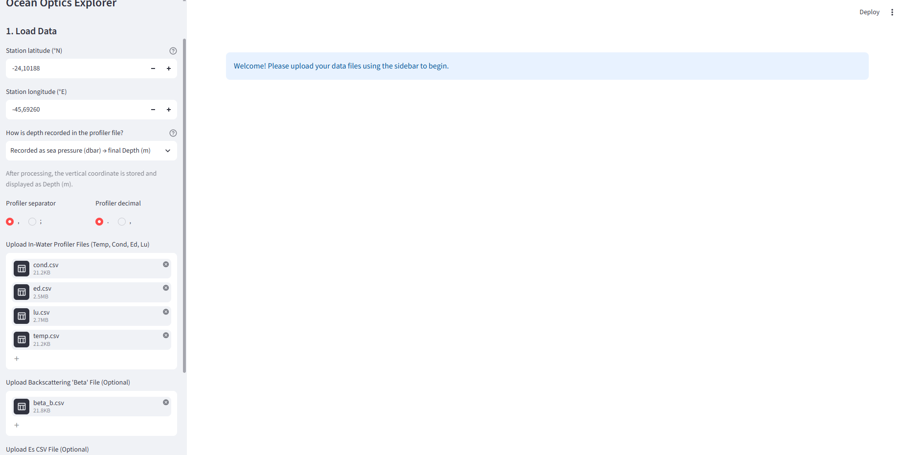
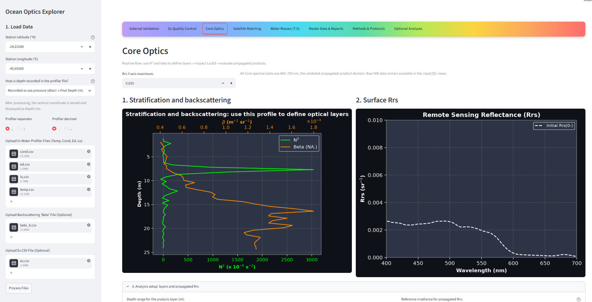
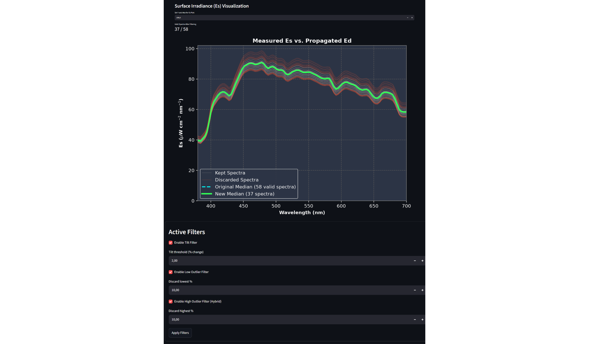
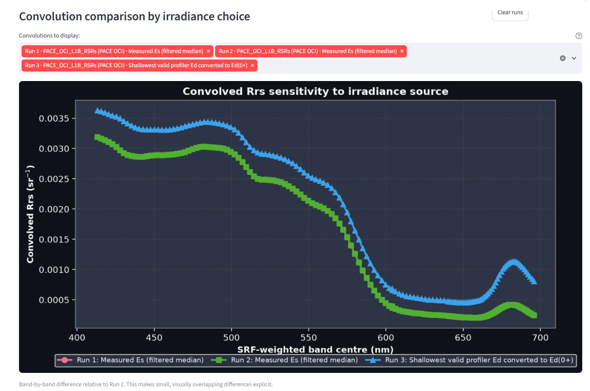
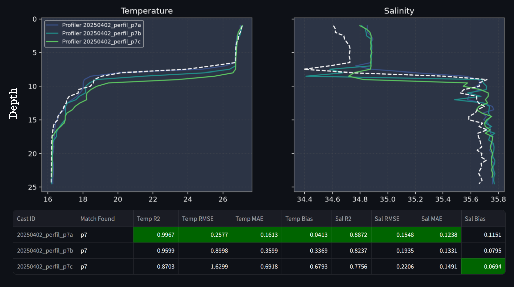

# Ocean Optics Explorer

**Interactive tools for in-water optics, hydrography, and satellite spectral matching**

Ocean Optics Explorer is a scientific application developed at Aquarela Lab, CEBIMar/USP, for processing, visualizing, and analysing in-water optical and hydrographic profiles.

The application includes tools for:

- analysis and visualization of hyperspectral optical profiles;
- calculation and comparison of remote-sensing reflectance (Rrs);
- spectral convolution using satellite sensor response functions, including PACE OCI;
- exploration of hydrographic and optical variables; and
- export of processed results.

## Application preview

### Data upload and processing setup

### Core optics workspace

### Surface irradiance quality control

### PACE OCI spectral convolution

### Hydrographic profile comparison

## Access the application

The public web application is currently being prepared. Its permanent link will be added here as soon as deployment is complete.

Official project repository: <https://github.com/AquarelaCebimar/Ocean-Color-Explorer>

## Development and access status

Ocean Optics Explorer is currently in beta development. The complete source archive is preserved in Zenodo under embargo until 2028. Source code, sample data, and associated scientific files are not distributed through this public landing repository during the embargo period.

## Citation

Ana Paula Piazza Forgiarini and Áurea Maria Ciotti. *Ocean Optics Explorer* (Version 0.1.0-beta) [Computer software]. Zenodo. <https://doi.org/10.5281/zenodo.21495851>

The Zenodo metadata are public, while access to the deposited files remains restricted until the embargo ends.

## Authors

- Ana Paula Piazza Forgiarini
- Áurea Maria Ciotti

Affiliation: Aquarela Laboratory, Center for Marine Biology, University of São Paulo (CEBIMar/USP), Brazil.

## Contact

Ana Paula Piazza Forgiarini - anapiazzaf@gmail.com

## Availability and rights

The hosted application is intended for public access when deployment is complete. Public distribution of the source code is planned after the embargo under the MIT License. During the embargo, the contents of this landing repository are covered by [NOTICE.md](NOTICE.md).
